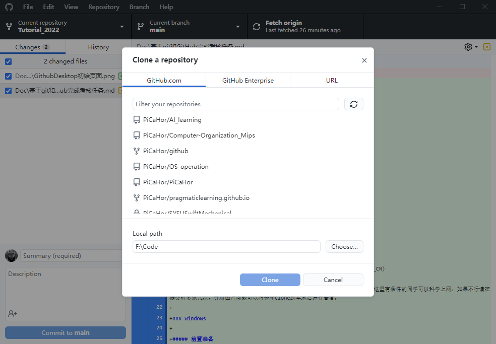

# 基于git和GitHub完成考核任务

Author：@PiCaHor

Revise：@LinHuangnan

| 版本 | 说明 |备注|
| ---- | ---- | ---- |
| v0.0.0 | 建立文档 |无|
| v0.0.1 | 添加GitHub基本概念的解释 |@LinHuangnan|

## 前言

该部分将会介绍如何使用git作为版本管理语言，GitHub作为仓库来进行本次考核

首先会对git的一些基本概念进行介绍

之后将介绍如何在 **Windows** 和**Linux**两个操作系统下完成考核

**Windows**操作系统下更着重于图形化界面的操作，而**Linux**操作系统下更注重命令行操作

如果你的目标是学到完整的项目管理，请专注学习Linux部分

关于git语言这里不进行更多的阐述，给出三个参考

[git官方文档](https://git-scm.com/book/zh/v2)

[基于java的git学习网站](https://learngitbranching.js.org/?locale=zh_CN)

[B站上比较好的git教程](https://www.bilibili.com/video/BV1pW411A7a5?share_source=copy_web&vd_source=34ed110d766ac5910b35ccc9afedda6e)

**注** 由于github容易出现域名污染，所以可能会出现登不上以及图片加载不成功的情况这里有条件的同学可以科学上网，如果不行请在提交时多试几次，针对图片问题可以将仓库clone到本地后进行查看。 

## GITHUB基本概念的说明

##### 首先区分上图的3个Tutorial_2022

假设小明是某位参加考核的人员，为了完成考核，他需要先克隆(执行`fork`操作）SYSU-AERO-SWIFT的Tutorial_2022仓库，此时他的仓库列表里就会出现一个Tutorial_2022仓库，这两个仓库的内容相同，小明的Tutorial_2022仓库其实是SYSU-AERO-SWIFT的Tutorial_2022仓库的一个副本

但是由于这两个仓库都属于远程仓库，即代码和文件是存在远程的服务器上，因此为了完成考核任务，小明需要把远程的Tutorial_2022仓库克隆（执行`clone`操作）到本地，形成本地的Tutorial_2022仓库，然后根据考核仓库的要求，在本地修改代码，添加文件，然后提交（执行`commit`操作）到本地的Tutorial_2022仓库，但是对本地的Tutorial_2022仓库进行修改并不会改变远程的仓库，因此小明需要先进行`push`操作，将本地仓库的修改同步到小明的Tutorial_2022,然后再进行`pull request`操作，将修改同步到SYSU-AERO-SWIFT的Tutorial_2022仓库，至此才算成功提交了任务成果

##### 对一些概念的理解

- `fork` 英语翻译过来就是叉子，动词形式则是分叉,在GITHUB中，fork则可以代表分叉、克隆出一个（仓库的）新拷贝，该拷贝包含了原来的仓库（即upstream repository，上游仓库）所有内容，如分支、Tag、提交，如果想将你的修改合并到原仓库中时，可以通过的`Pull Request`把你的提交贡献回原仓库
- `clone` 将github中的远程仓库克隆到自己本地电脑中
- `commit` 将自己在本地创建或者修改的代码，文件commit（提交）到本地仓库
- `pull`  将远程仓库的数据同步到本地仓库，为了和远程仓库相匹配。举个例子，小明一周之前从远程`clone`了一个仓库到本地，但是在这一周时间内该仓库可能被小红进行了修改，导致远程仓库和本地仓库的内容不同，因此就需要进行一次`pull`操作将数据同步
- `push` 将本地仓库的修改提交到远程仓库
- `pull request` 简称`pr`,在 GitHub 上发送 Pull Request 后，发送过去的 Pull Request 是否被采纳，要由接收方仓库的管理者进行判断。在上图的例子中，小明需要发起一个Pr,然后空队的管理人员将会接受小明发起的pr，接受pr的过程称为`merge`,从而实现LHN的Tutorial_2022仓库和SYSU-AERO-SWIFT的Tutorial_2022仓库内容的同步
- `branch` GitHub仓库默认有一个main的分支，当我们在main分支开发过程中接到一个新的功能需求，我们就可以新建一个分支同步开发而互不影响，开发完成后，在合并merge到主分支main上。
- 
**注** 在考核过程中，我们会给每一位参加考核的同学建立一个以该同学名字命名的分支，例如每一个同学只能在自己的名字对应的分支下面完成考核，不得直接在main分支下完成考核，因为只有这样我们才能区分参加考核的同学，并予以评分

### Windows

##### 前置准备

- Windows系统
- 较为充足的存储空间
- GitHub Desktop-[下载地址](https://desktop.github.com/)

- github账号

##### 获取仓库

首先来到考核仓库，在右上角点击Fork按钮，完成后你就成功的将考核仓库拷贝一份自己的部分，以后你都可以在头像下的Your repositories中找到它

然后打开Github Desktop 在菜单栏中选择File-Clone repository

如图：

选择对应的仓库与保存地址，点击`clone`。至此你的远程仓库就克隆到本地了

接下来你只需要将你完成的内容在对应的文件夹下保存

##### 更新仓库

当你在后续时间中打开项目时，请留意是否有`Pull origin`按钮

如图

点击它更新远程仓库的内容

##### 将任务完成成果同步到个人的考核仓库

当你对本地仓库进行编辑后你的所有操作都会被track，在desktop上会有对应的显示

当你确定好你要提交的内容后（你可以通过取消文件前面的选择来选择部分上传）

下面的过程就是编辑Comment

你需要在头像旁边的summery部分添加梗概说明并可以在Descrption部分添加必要的说明

对于梗概的规定在考试规范中规定

完成后点击`Commit to main`

然后点击主页面上的`Push origin`的按钮，便成功将更新推到了个人的远程仓库之中。

##### 提交pr请求合并到空队的考核仓库

当你完成对于所有内容的修改之后来到github上自己fork的仓库

如果你有修改可以看见如图

点击`pull requests` 在页面中点击`New pull request`

在base repository-base中选择自己对应的分支（请注意不要合并到主仓库的main，否则不会予以合并）

然后点击`Create pull request`

在接下来的页面中取消勾选`Allow edits by maintainers`同时在Title与下方添加必要的说明后点击`Create pull request`

下一个页面中在右侧有五个标签栏：

1. Reviewers: 这里可以 @考核负责人让他们来批改你的工作，请在这里点选所有考核负责人。
2. Assignees: 这里填申请人，也就是你自己。
3. Labels: 对 Issue 和 Pull request 进行分类，每个标签都有对应说明，请按实际情况选择，如果是提交成果，选择 `submit`，如果你是第一次使用这个功能，选择 `First Issue!`，各位会欢迎你的到来。
4. Projects: 忽略
5. Milestone: 忽略。

而后只需小小等待以下冲突检测通过后，便可以联系学长姐将你的提交合并到主仓库中

## Linux-UBUNTU

##### 前置准备

- Ubuntu 或者其他的Linux/Unix系统
- github账号
